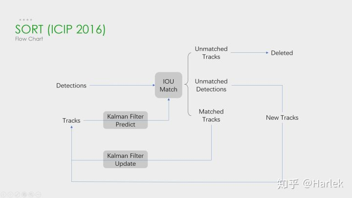
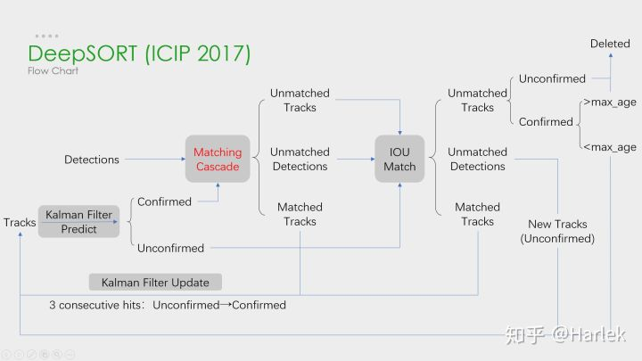

# Compressive Tracking and KCF Tracking

## Reference ##
<http://www4.comp.polyu.edu.hk/~cslzhang/CT/CT.htm>   
<https://github.com/joaofaro/KCFcpp>   

<br>

# 目标跟踪
—— https://zhuanlan.zhihu.com/p/97449724?from_voters_page=true

#### 相关方向

- **单目标跟踪（VOT/SOT）**：第一帧给一个 bounding box，然后进行跟踪。*与多目标跟踪的区别*：只有单个目标，目标类别不做限定，难以区分相似的类内对象。*研究趋势*：从基于 detection 的 tracking 思维中摆脱，采用多分支多通道拟合目标的位置、姿态等信息。*数据集*：VOT Challenge。
- **目标检测（Detec）**：输入一张图片，输出目标的类别信息和位置信息。*与多目标跟踪的区别*：是多目标跟踪问题的输入。*研究趋势*：从 One Stage、Two Stage 的 Anchor Based 到 Anchor Free。*数据集*：VOC、COCO。
- **基于视频的检测**：输入为视频序列。*与多目标跟踪的区别*：没有数据关联的过程（没有轨迹ID）。*研究趋势*：两种流派：基于检测和跟踪的算法；基于光流等动态信息。*数据集*：ImageNet VID、YTO。
- **重识别（Re-ID）**：图像检索的子问题。根据与被查询图片的相似度，降序排列。*与多目标跟踪的区别*：作为目标跟踪中一种非常有效的外观特征。缺少时空信息和运动信息。*研究趋势*：表征学习、度量学习、局部特征、视频序列、GAN造图、无监督、半监督。最大难点：domain的变化。*数据集*：Market1501、CHUK03。
- **MTMCT**：多目标多相机跟踪。*与多目标跟踪的区别*：跨摄像头、多视频。*研究趋势*：基于Re-ID延申的方向。*数据集*：DukeMTMC。
- **姿态追踪**：人体姿态估计+人体姿态追踪。*与多目标跟踪的区别*：可以引入MOT中，人少时精度更高，但人多场景性能不好。*数据集*：PoseTrack。
- **非主流的多目标追踪**：不基于检测的多目标追踪。*与多目标跟踪的区别*：与基于检测的追踪相比建模复杂、难以实时。*研究趋势*：图问题、蒙特卡洛光流、多假设跟踪、随机有限集。*数据集*：MOT Challenge。

#### 核心步骤

MOT算法的通常工作流程：（1）给定视频的原始帧；（2）运行对象检测器以获得对象的边界框；（3）对于每个检测到的物体，计算出不同的特征，通常是视觉和运动特征；（4）之后，相似度计算步骤计算两个对象属于同一目标的概率；（5）最后，关联步骤为每个对象分配数字ID。

> 因此，绝大多数MOT算法无外乎就这四个步骤：①检测 ②特征提取、运动预测 ③相似度计算 ④数据关联。 其中影响最大的部分在于检测，检测结果的好坏对于最后指标的影响是最大的。

> 但是，多目标追踪的研究重点又在相似度计算和数据关联这一块。 由此导致一个问题：你设计出更好的关联算法可能就提升了0.1个点，别人用一些针对数据集的trick消除了一些漏检可能就能涨好几个点。

由此导致：研究更好的数据关联的回报收益很低，多目标追踪这一领域虽然工业界很有用，但学术界里数据集指标存在一些问题。

#### SORT 和 DeepSORT

从这两个工业界关注度最高的算法说起，SORT作为一个粗略的框架，核心就是两个算法：**卡尔曼滤波**和**匈牙利匹配**。

**卡尔曼滤波分为两个过程：预测和更新。**预测过程：当一个小车经过移动后，且其初始定位和移动过程都是高斯分布时，则最终估计位置分布会更分散，即更不准确；更新过程：当一个小车经过传感器观测定位，且其初始定位和观测都是高斯分布时，则观测后的位置分布会更集中，即更准确。（基于观测值的更新）

**匈牙利算法解决的是一个分配问题。**sk-learn 库的 linear_assignment_ 和 scipy 库的 linear_sum_assignment 都实现了这一算法，只需要输入 cost_matrix 即：代价矩阵，就能得到最优匹配。不过要注意的是这两个库函数虽然算法一样，但给的输出格式不同。

> **DeepSORT** 的优化主要就是基于匈牙利算法里的这个代价矩阵。它在 IOU Match 之前做了一次额外的级联匹配，利用了**外观特征**和**马氏距离**。

外观特征就是通过一个**Re-ID**的网络提取的，提取这个特征的过程和NLP里词向量的嵌入过程（embedding）很像，所以有的论文也把这个步骤叫做嵌入。然后是因为**欧氏距离**忽略空间域分布的计算结果，所以增加了**马氏距离**作为运动信息的约束。

##### SORT

<div align="center">

</div>

SORT的流程图非常重要，可以看到整体可以拆分为两个部分，分别是**匹配过程**和**卡尔曼预测**加**更新**过程，都用灰色框标出来了。多目标追踪的大框架基本都由此而来。

关键步骤：轨迹卡尔曼滤波**预测** → 使用**匈牙利算法**将预测后的tracks和当前帧中的detecions进行匹配（**IOU匹配**） → 卡尔曼滤波**更新**。

> 对于没有匹配上的轨迹，也不是马上就删掉了，有个T_lost的保存时间，但SORT里把这个时间阈值设置的是1，也就是说对于没匹配上的轨迹相当于直接删了。

##### 注意：
首先，恒定速度模型不能很好地预测真实的动力学，其次，SORT主要关注的是帧到帧的跟踪，其中对象的重新识别超出了框架的范围。

##### DeepSORT

<div align="center">

</div>

DeepSORT算法的流程图和SORT基本一样，就多了**级联匹配**（Matching Cascade）和**新轨迹的确认**（confirmed）。

关键步骤：轨迹卡尔曼滤波**预测** → 使用**匈牙利算法**将预测后的tracks和当前帧中的detecions进行匹配（**级联匹配**和**IOU匹配**） → 卡尔曼滤波**更新**。

> 级联匹配是核心，就是红色部分，DeepSORT的绝大多数创新点都在这里面。

##### 注意：
关于为什么新轨迹要连续三帧命中才确认？个人认为有这样严格的条件和测试集有关系。因为测试集给的检测输入非常的差，误检有很多，因此轨迹的产生必须要更严格的条件。

```
级联匹配流程图里上半部分就是特征提取和相似度估计，也就是算这个分配问题的代价函数。主要由两部分组成：代表运动模型的马氏距离和代表外观模型的Re-ID特征。

级联匹配流程图里下半部分数据关联作为流程的主体。为什么叫级联匹配，主要是它的匹配过程是一个循环。
从missing age=0的轨迹（即每一帧都匹配上，没有丢失过的）到missing age=30的轨迹（即丢失轨迹的最大时间30帧）挨个的和检测结果进行匹配。也就是说，对于没有丢失过的轨迹赋予优先匹配的权利，而丢失的最久的轨迹最后匹配。
```

**卡尔曼滤波** —— http://www.harlek.cn/2019/12/02/qia-er-man-lu-bo/

<br>

# Tracking By Detection

—— 基于检测的多目标追踪

Integrated object detection and tracking

> 什么是真正地把检测和跟踪做在一起？通常的目标检测都是一个非常干净的视频目标检测框架，但是没有实现帧间box的关联，也就是说没有实现跟踪。


# 传统的跟踪模型

告诉目标物体长什么样，然后在下一帧去搜索最接近目标长相的矩形框，然后迭代跟踪。

# Tracking By Detection 和传统模型两者的区别

前者是给定一个候选框，算法判定这个框是或者不是目标（0-1选择），后者计算RP候选框与目标的相似度，最后选择最高相似度的框。因此，前者（基于检测的）模型是判别类模型，后者（传统的）模型是生成类模型。

<br>

## 其他文章
- 一文带你了解视觉目标跟踪 https://www.sohu.com/a/330699110_651893

<br>

# BlobTrack
—— 基于检测的多目标快速跟踪

``` C++
#include <chrono>
#include "BlobTrack.h"

BlobTrack *track = new BlobTrack();
std::vector<target_Blob> vExist_targets;


//blobs.
std::vector<target_Blob> currentFrameBlobs;
std::chrono::time_point<std::chrono::system_clock> start2;
start2 = std::chrono::system_clock::now();

//获取检测的bbox结果（cv::Rect result），存入blob对象。
target_Blob possibleBlob;
cv::Point currentCenter;

possibleBlob.currentBoundingRect = cv::Rect(result.x, result.y, result.width, result.height);
currentCenter.x = (possibleBlob.currentBoundingRect.x + possibleBlob.currentBoundingRect.x + possibleBlob.currentBoundingRect.width) / 2;
currentCenter.y = (possibleBlob.currentBoundingRect.y + possibleBlob.currentBoundingRect.y + possibleBlob.currentBoundingRect.height) / 2;
possibleBlob.centerPositions.push_back(currentCenter);
possibleBlob.dblCurrentDiagonalSize = sqrt(pow(possibleBlob.currentBoundingRect.width, 2) + pow(possibleBlob.currentBoundingRect.height, 2));
possibleBlob.dblCurrentAspectRatio = (float)possibleBlob.currentBoundingRect.width / (float)possibleBlob.currentBoundingRect.height;
possibleBlob.blnStillBeingTracked = true;
possibleBlob.blnCurrentMatchFoundOrNewBlob = true;
possibleBlob.intNumOfConsecutiveFramesWithoutAMatch = 0;

currentFrameBlobs.push_back(possibleBlob);

//track（所谓的多目标跟踪即ID关联）
track->matchCurrentFrameBlobsToExistingBlobs(vExist_targets, currentFrameBlobs);
std::cout << "BlobTrack Time: " << std::chrono::duration_cast<std::chrono::microseconds>(std::chrono::system_clock::now() - start2).count() << " us" << endl;

//Draw
for (unsigned int i = 0; i < vExist_targets.size(); i++) {
    putText(frame, std::to_string(i), vExist_targets[i].centerPositions.back(), 0, 1, Scalar(255, 255, 0));
    rectangle(frame, vExist_targets[i].currentBoundingRect, Scalar(255, 255, 0), 2);
}

imshow(window_name, frame);
char key_val = (char)waitKey(10);
if (27 == key_val) break;
```
